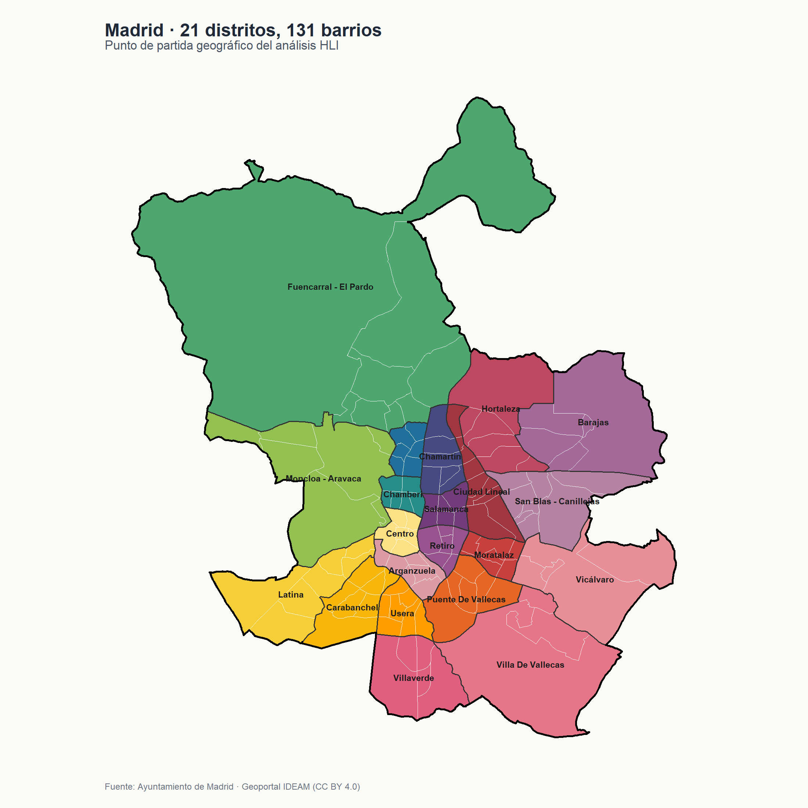
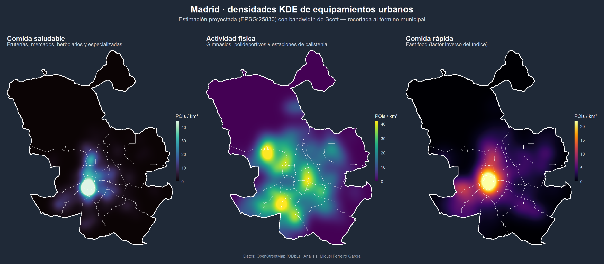
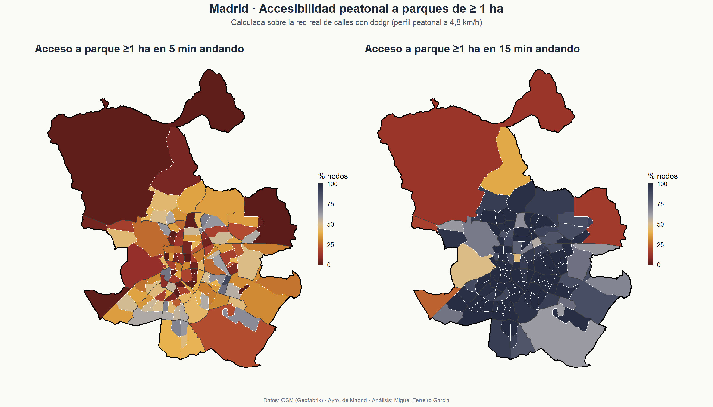
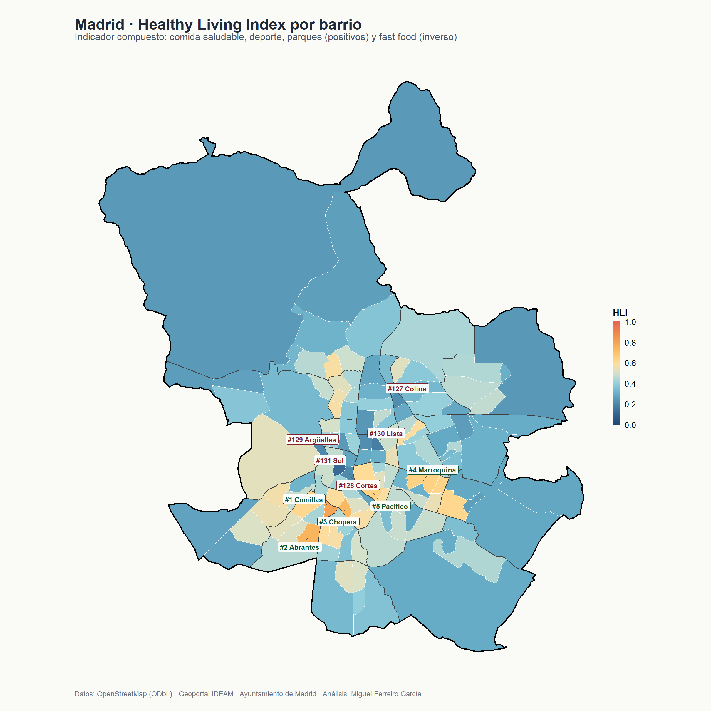
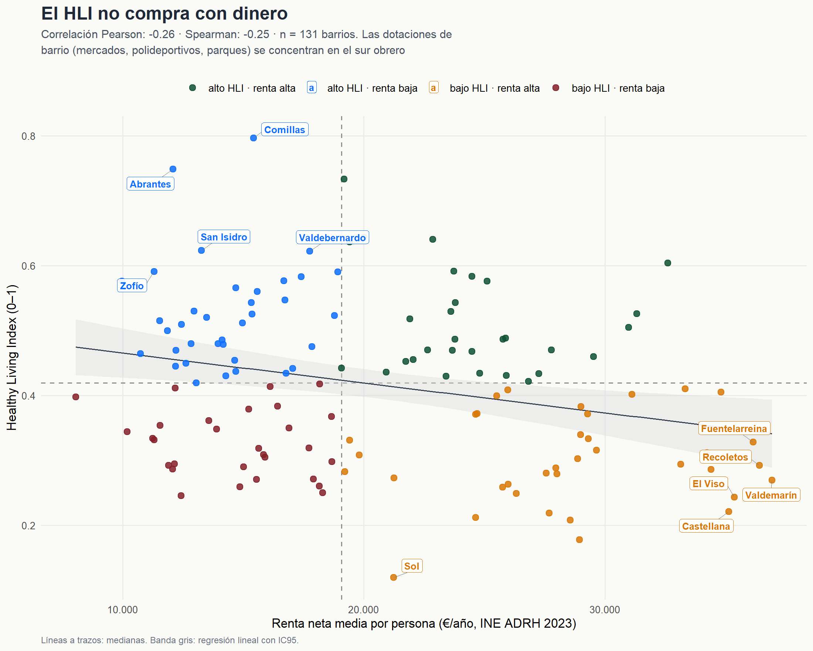
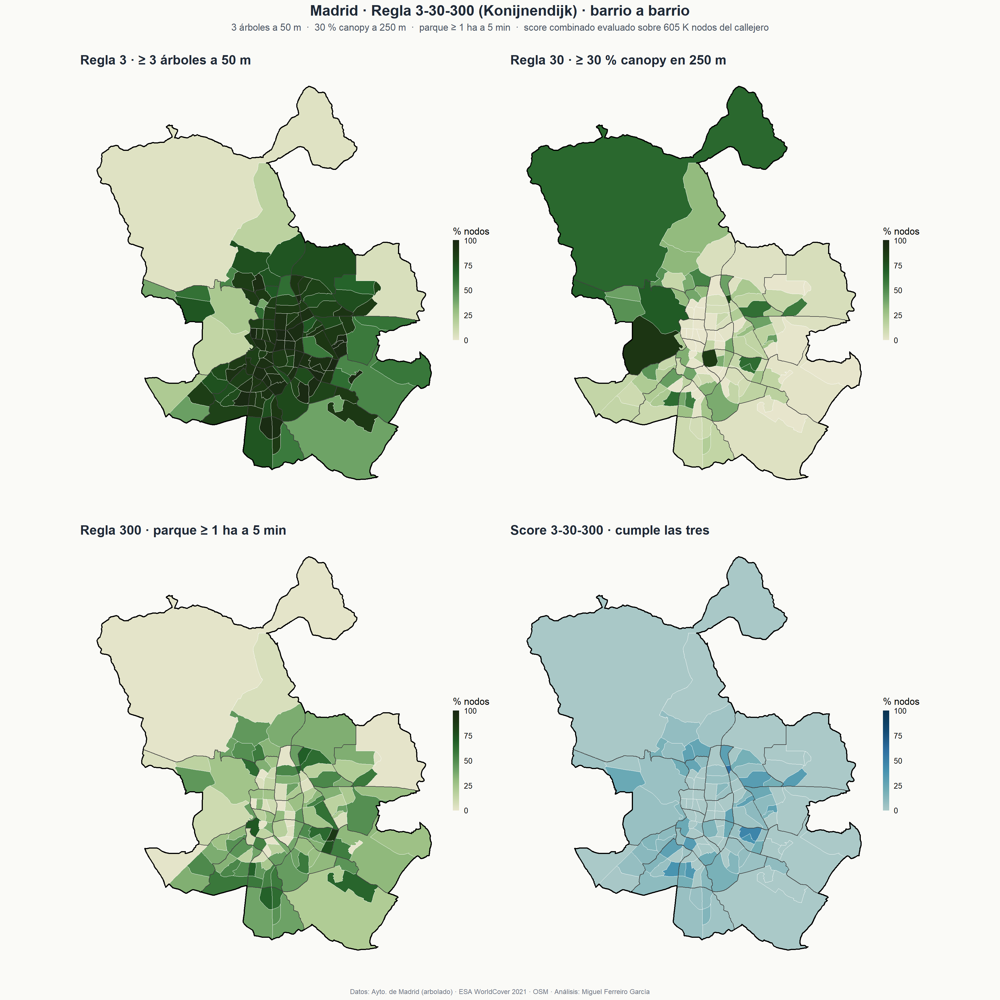

```{r setup}
#| include: false
suppressPackageStartupMessages({
  library(sf)
  library(dplyr)
  library(ggplot2)
})
```

# Resumen ejecutivo {.unnumbered}

¿Es Madrid una ciudad fácil para llevar una vida saludable? ¿Y lo es **igual de fácil** en todos sus barrios?

Este documento responde a esas preguntas combinando datos abiertos (OpenStreetMap, INE, Ayuntamiento de Madrid, ESA WorldCover) con análisis espacial en R. El resultado es un **Healthy Living Index (HLI)** por barrio y una evaluación del cumplimiento de la **regla 3-30-300** de urbanismo verde de Cecil Konijnendijk.

::: {.grid}
::: {.g-col-4 .text-center}
### **131**
barrios analizados
:::
::: {.g-col-4 .text-center}
### **−0,26**
correlación HLI ↔ renta (Pearson)
:::
::: {.g-col-4 .text-center}
### **9 %**
mediana de barrios que cumplen las tres reglas 3-30-300
:::
:::

::: {.callout-tip appearance="simple"}
**Hallazgo central.** El HLI v1 (densidad de equipamientos saludables, parques y fast food invertido) correlaciona **negativamente** con la renta: el sur obrero domina el ranking, el norte rico cae al fondo. La regla 3-30-300 combinada **borra esa correlación** (Pearson −0,04) — cada componente capta una dimensión distinta y se compensan.
:::

# 1 · Marco metodológico

## 1.1 Pregunta de investigación

Cuantificar, a nivel de barrio, la facilidad para llevar un estilo de vida saludable en el municipio de Madrid, integrando:

- **Acceso a alimentación saludable** (fruterías, mercados, tiendas especializadas).
- **Acceso a actividad física** (gimnasios, instalaciones deportivas).
- **Cercanía a espacios verdes** (parques mayores de 1 ha).
- **Penetración de comida rápida** como factor inverso.
- **Cubierta arbórea** y proximidad a verde urbano (regla 3-30-300).
- **Equidad**: ¿se distribuye el índice de forma justa respecto a la renta?

## 1.2 Pipeline de análisis

```{mermaid}
%%| label: fig-pipeline
%%| fig-cap: "Pipeline de análisis del proyecto."

flowchart LR
  A[OSM<br/>Overpass + Geofabrik] --> B[Limpieza<br/>+ filtrado]
  C[Ayto Madrid<br/>distritos · barrios · arbolado] --> B
  D[INE<br/>renta + sec. censales] --> B
  E[ESA WorldCover<br/>2021 · 10 m] --> B
  B --> F[KDE proyectado<br/>EPSG:25830]
  B --> G[Isócronas peatonales<br/>dodgr]
  B --> R[Regla 3-30-300<br/>raster + focal]
  F --> H[HLI v1<br/>por barrio]
  G --> H
  R --> S[Score 3-30-300<br/>por barrio]
  H --> I[Cruce con renta<br/>+ scatter equidad]
  S --> I
  I --> J[Mapas interactivos<br/>+ dashboard shinylive]
```

# 2 · Datos {#sec-datos}

## 2.1 Marco administrativo

El análisis se hace sobre el **término municipal de Madrid** (604 km²), desagregado en sus **21 distritos** y **131 barrios** oficiales.

```{r mapa-base}
#| label: fig-mapa-base
#| fig-cap: "Madrid municipio: 21 distritos y 131 barrios. Fuente: Ayuntamiento de Madrid · Geoportal IDEAM (CC BY 4.0)."
#| fig-width: 9
#| fig-height: 9


```

Los datos administrativos se descargan automáticamente del [Geoportal IDEAM](https://geoportal.madrid.es/) y se almacenan localmente en `data/processed/` como GeoPackage en CRS **EPSG:25830** (ETRS89 / UTM 30N), el sistema oficial para España peninsular.

::: {.callout-tip collapse="true"}
## Reproducibilidad: ¿cómo se obtienen estos datos?

```r
source("R/01_descargar_admin.R")  # descarga + limpieza
source("R/02_mapa_base.R")        # mapa estático + interactivo
```

El script descarga los shapefiles desde el geoportal, los reproyecta a EPSG:25830, valida la geometría y deriva el polígono del término municipal por unión de los 21 distritos.
:::

## 2.2 Capas temáticas

Cuatro capas de equipamientos / espacios verdes desde **OpenStreetMap** (Overpass para queries selectivas y Geofabrik para queries voluminosas), más el inventario municipal de árboles del Ayto y la cubierta arbórea de **ESA WorldCover 2021**.

| Capa | Tags / fuente | Total |
|---|---|---:|
| Comida saludable | `shop=greengrocer/health_food/herbalist/deli/farm`, `amenity=marketplace` | **555** |
| Actividad física | `leisure=fitness_centre/fitness_station/sports_centre` | **958** |
| Comida rápida | `amenity=fast_food` | **1.073** |
| Espacios verdes | `leisure=park` (≥ 1 ha) + Casa de Campo manualmente | **1.702** polígonos · 6.233 ha |
| Arbolado urbano | datos.madrid.es · dataset 300761 (alineación + zonas verdes) | **793 K** árboles |
| Cubierta arbórea | ESA WorldCover 2021 v200 (10 m, clase Tree cover) | tile N39W006 |

::: {.callout-note}
**Decisión metodológica.** La capa "comida saludable" se construyó con whitelist explícita por tag tras verificar contra Taginfo: `shop=organic` y `marketplace=farmers_market` no se usan en Madrid; `shop=supermarket` es demasiado laxo (incluye Mercadona, Lidl). `landuse=forest` se descartó porque no separa El Pardo bosque del casco urbano — único rescate manual: **Casa de Campo** (1.373 ha), que en OSM no aparece como `leisure=park`.
:::

# 3 · Densidades y distancias {#sec-densidades}

## 3.1 KDE proyectado

La estimación de densidad por kernel se calcula sobre el sistema **EPSG:25830** (metros) — corrigiendo el error metodológico de la versión original, que ejecutaba el KDE en grados geográficos. El bandwidth se obtiene con la regla de Scott vía `spatstat::bw.scott()`.

```{r kde-panel}
#| label: fig-kde
#| fig-cap: "Densidad de equipamientos por km² (KDE 100 m, recortado al municipio)."
#| fig-width: 16
#| fig-height: 7


```

Las tres capas tienen estructuras espaciales diferentes:

- **Comida saludable** muestra un núcleo intenso en Centro (mercados históricos) y picos secundarios en distritos residenciales acomodados (Salamanca, Chamberí).
- **Actividad física** está distribuida de forma más homogénea, con concentraciones en distritos centrales y ensanches.
- **Comida rápida** se concentra en el Centro (turismo) y en arterias comerciales periféricas.

## 3.2 Accesibilidad peatonal con `dodgr`

Sobre la red de calles del extracto Geofabrik (152 K segmentos, 605 K vértices) calculamos la distancia mínima al parque ≥ 1 ha más cercano y marcamos los nodos accesibles a 5 / 10 / 15 min andando (perfil peatonal a 4,8 km/h ≈ 80 m/min, equivalente a 400 / 800 / 1.200 m peatonales).

```{r acc-panel}
#| label: fig-acc
#| fig-cap: "Accesibilidad peatonal a parques ≥ 1 ha. Cuanto más oscuro, más nodos del barrio cumplen el umbral."
#| fig-width: 14
#| fig-height: 8


```

El patrón es **inverso al esperado**: los barrios obreros del sur están mejor servidos por parques grandes que los barrios ricos del norte. Comillas (Carabanchel) cumple la regla 300 m en el **100 %** de sus nodos a 15 min; Castellana (Salamanca) solo en el **47 %**.

# 4 · Healthy Living Index {#sec-hli}

## 4.1 Construcción del índice

Por cada barrio (de los 131) calculamos:

- densidad de **comida saludable** (POIs / km²)
- densidad de **gimnasios y deporte** (POIs / km²)
- densidad de **fast food** (POIs / km²) — factor inverso
- **cubierta de parques** (% del barrio)

Cada indicador se normaliza al rango [0, 1] usando rango robusto (percentiles 5–95) para que un outlier no aplaste al resto. El fast food se invierte (1 − x). El HLI es la media simple de los 4 componentes.

```{r hli-mapa}
#| label: fig-hli
#| fig-cap: "Healthy Living Index por barrio."
#| fig-width: 10
#| fig-height: 10


```

## 4.2 Cruce con renta · el hallazgo principal

```{r hli-renta}
#| label: fig-equidad
#| fig-cap: "HLI frente a renta neta por persona (€/año, INE ADRH 2023). Cada punto es un barrio. Línea de regresión en rojo."
#| fig-width: 10
#| fig-height: 7


```

El **HLI correlaciona negativamente con la renta** (Pearson **−0,26**, Spearman −0,25). Los barrios con mejor dotación pública para una vida saludable se concentran en el **sur obrero** (Carabanchel, Usera, Puente de Vallecas); los barrios de mayor renta del **norte** (Salamanca, Chamartín, Moncloa) caen al fondo del ranking.

| | alto HLI | bajo HLI |
|---|---|---|
| **renta alta** | 30 barrios | 36 barrios — *trampas* |
| **renta baja** | 36 barrios — *gangas* | 29 barrios |

- *Top "gangas":* Comillas, Abrantes, Pradolongo, Zofío, San Isidro
- *Top "trampas":* Valdemarín, Recoletos, Fuentelarreina, El Viso, Castellana
- *Caso extremo:* Sol — HLI 0,12, 123 fast food/km², 0 % cubierta verde

# 5 · La regla 3-30-300 {#sec-regla}

La regla **3-30-300** propuesta por Cecil Konijnendijk (2021) es un estándar simple y accionable de urbanismo verde:

::: {.grid}
::: {.g-col-4 .text-center}
### 3
**árboles visibles** desde cada vivienda
:::
::: {.g-col-4 .text-center}
### 30 %
**cubierta arbórea** por barrio
:::
::: {.g-col-4 .text-center}
### 300 m
al **espacio verde** más cercano
:::
:::

## 5.1 Implementación por nodo

Hemos evaluado las tres reglas sobre **605 K nodos del callejero** de Madrid:

- **Regla 3:** `terra::rasterize` de los 793 K árboles del inventario municipal a 10 m, focal sum con kernel circular de 50 m, extract puntual sobre los nodos. Cumple = ≥ 3 árboles a 50 m.
- **Regla 30:** ESA WorldCover 2021 v200 (10 m, clase 10 = Tree cover), reproyectado a EPSG:25830, focal sum con kernel circular de 250 m. Cumple = ≥ 30 % canopy en el buffer.
- **Regla 300:** equivale a `acc_5min` del paso 3.2 (parque ≥ 1 ha a ≤ 400 m peatonales).

## 5.2 Resultados por regla y score combinado

```{r regla-panel}
#| label: fig-3-30-300
#| fig-cap: "Las tres reglas y el score combinado por barrio. Madrid suspende: solo el 9 % mediano de los barrios cumple las tres a la vez."
#| fig-width: 16
#| fig-height: 16


```

| Regla | % nodos ciudad | Mediana barrios | Mejor | Peor |
|---|---:|---:|---|---|
| 3 — ≥3 árboles 50 m | 64,0 % | 87,7 % | Castellana, Hellín, Lista (100 %) | El Pardo (3,1 %), Aeropuerto (5,7 %) |
| 30 — ≥30 % canopy 250 m | 26,7 % | 12,5 % | Casa de Campo (90 %), Los Jerónimos (88 %) | Centro, Salamanca, Retiro (0 %) |
| 300 — parque ≥1 ha ≤5 min | — | — | Comillas, Pradolongo (100 %) | Castellana, Recoletos (≤1 %) |
| **Score combinado** | — | **9 %** | **Atalaya** 60 %, **Marroquina** 48 % | Centro, Salamanca, Retiro (0 %) |

::: {.callout-tip}
**Tensión Salamanca.** Castellana, Goya y Lista alcanzan el **100 %** en regla 3 (alineaciones viarias densas de árboles inventariados) pero **0 %** en regla 30: los árboles individuales de viario no llegan al 30 % de cubierta continua según ESA WorldCover. El estándar 3-30-300 está diseñado precisamente para detectar esta diferencia entre "hay árboles" y "hay barrio verde".
:::

# 6 · Equidad

El **score combinado 3-30-300 borra la correlación con renta** (Pearson **−0,04** vs −0,26 del HLI v1). La descomposición por componente muestra por qué:

| Métrica | Pearson vs renta neta |
|---|---:|
| HLI v1 | −0,26 |
| Score 3-30-300 | −0,04 |
| Regla 3 (≥3 árboles 50 m) | +0,05 |
| Regla 30 (≥30 % canopy 250 m) | +0,13 |
| Regla 300 (parque ≥1 ha 5 min) | −0,24 |

Cada componente capta una dimensión distinta y se compensan: la regla 3 (alineación viario) favorece a los barrios densos del centro; la regla 30 (canopy continuo) favorece zonas periféricas con grandes parques; la regla 300 reproduce el patrón sur-rico-mejor del HLI.

# 7 · Recursos interactivos {#sec-recursos}

## 7.1 Mapas

Los cuatro mapas Leaflet reproducen las capas anteriores con popups y filtros:

::: {.grid}
::: {.g-col-6}
**[Ranking HLI por barrio](outputs/maps/03_hli_interactivo.html)**

Coroplético del HLI v1; popup con desglose de los 4 componentes.
:::
::: {.g-col-6}
**[HLI ↔ renta + residual](outputs/maps/04_equidad_interactivo.html)**

Tres capas: HLI, renta neta y residual del modelo HLI ~ renta.
:::
::: {.g-col-6}
**[Accesibilidad peatonal](outputs/maps/05_accesibilidad_interactivo.html)**

% de nodos con parque ≥ 1 ha a 5 / 10 / 15 minutos andando.
:::
::: {.g-col-6}
**[Regla 3-30-300](outputs/maps/06_3_30_300_interactivo.html)**

Cuatro capas: regla 3, regla 30, regla 300 y score combinado.
:::
:::

## 7.2 Dashboard `shinylive`

Una app Shiny ejecutándose **directamente en el navegador** como WebAssembly (sin servidor). Permite explorar las 14 métricas barrio a barrio, comparar hasta 6 barrios en radar, ver scatters de equidad y descargar la tabla en CSV/Excel.

::: {.callout-note appearance="simple"}
**Atención:** la primera carga del dashboard tarda **30–60 s**: el navegador descarga R y los paquetes WASM. En recargas posteriores arranca al instante. [Si el iframe falla, abre el dashboard en pantalla completa →](app/){target="_blank"}
:::

<iframe src="app/" width="100%" height="850" frameborder="0" loading="lazy" title="Madrid HLI dashboard" style="border:1px solid #e5e7eb;border-radius:6px"></iframe>

[Abrir dashboard en pantalla completa](app/){.btn .btn-primary target="_blank"}

# Apéndice · Reproducibilidad {.appendix}

El proyecto sigue una cadena de **18 scripts R numerados** que se ejecutan en orden. El entorno completo se restaura con `renv::restore()`.

```r
# Restaurar el entorno exacto
renv::restore()

# Pipeline completo (los scripts son idempotentes)
for (s in sort(list.files("R", pattern = "^[0-9]{2}_.*\\.R$", full.names = TRUE))) {
  message("→ ", s)
  source(s)
}

# Renderizar este documento
quarto::quarto_render("index.qmd")
```

```{r session-info}
#| code-fold: true
#| code-summary: "Información de la sesión R"
sessionInfo()
```

::: {.callout-tip appearance="simple"}
**Código fuente:** [github.com/miguelferre/Madrid_HLI](https://github.com/miguelferre/Madrid_HLI)
:::
